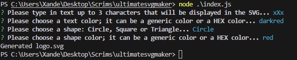
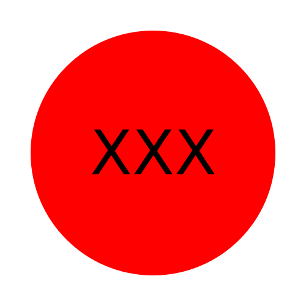

# Ultimate SVG Maker




## Description
This application is the week 10 project of the edX/Monash bootcamp with a focus on Object-Orientated Programming and testing.  The task was to build an SVG based off user input from the terminal using the Inquirer module.  I personally liked this method of coding, as it kept everything organised and reusable.  As for testing the application, I used the jest module.  During the week when we were learning to use jest, I was fairly confused for why we were using it, but after I took some time to read over it and understand the syntax, it all made sense and I was able to feature it into my application without any troubles!

The acceptance criteria of this project were as follows:

```md
GIVEN a command-line application that accepts user input
WHEN I am prompted for text
THEN I can enter up to three characters
WHEN I am prompted for the text color
THEN I can enter a color keyword (OR a hexadecimal number)
WHEN I am prompted for a shape
THEN I am presented with a list of shapes to choose from: circle, triangle, and square
WHEN I am prompted for the shape's color
THEN I can enter a color keyword (OR a hexadecimal number)
WHEN I have entered input for all the prompts
THEN an SVG file is created named `logo.svg`
AND the output text "Generated logo.svg" is printed in the command line
WHEN I open the `logo.svg` file in a browser
THEN I am shown a 300x200 pixel image that matches the criteria I entered
```

## Table of Contents

1. [Installation](#installation)
2. [Application Walkthrough](#application-walkthrough)
3. [Usage](#usage)
4. [License](#license)
5. [Contribution](#contribution)
6. [Questions](#questions)

## Installation
To use this application you will need [node.js](https://nodejs.org/en) installed.

## Application Walkthrough
Please click [here]() to see the video walkthrough of the Ultimate SVG Maker.<br>
If you are unable to view the link, it can be downloaded from Google Drive at the same link.

## Usage
1. Execute 'node index.js' in the './ultimatesvgmaker/' directory.
2. Type or paste in your information when prompted.
3. When 'Generated logo.svg' is output to the terminal, `logo.svg` will be found in the 'examples' folder
4. The logo can be viewed by opening index.html in the same 'examples' folder.
5. You now have your very own high quality logo, making all graphic designers redundant, and crushing the logo making market.


## License
<br>
This project is covered under the MIT License.

## Contribution
x4ndez: <https://github.com/x4ndez>

## Questions
Questions may be directed to my LinkedIn: <https://www.linkedin.com/in/alexandernanfro/>.